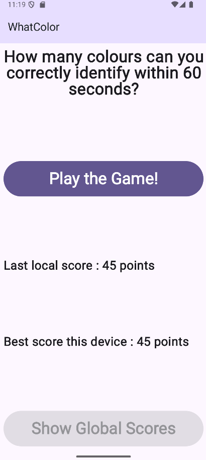
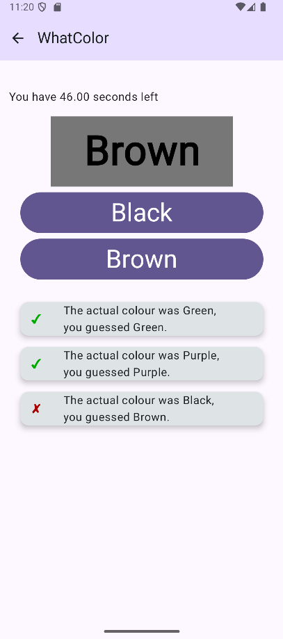
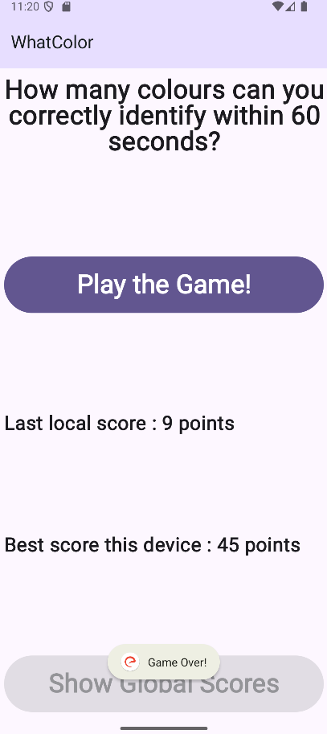

# WhatColor
## Description
WhatColor est une application Android de jeu de reconnaissance de couleurs qui met à l'épreuve votre capacité à identifier rapidement les couleurs. Le principe est simple mais addictif : vous disposez de 60 secondes pour identifier correctement le plus grand nombre de couleurs possible.

Le jeu présente un défi de perception visuelle où un nom de couleur est affiché dans une couleur différente. Vous devez choisir la vraie couleur du texte, pas celle qui est écrite. Par exemple : le mot "ROUGE" pourrait être affiché en bleu, et vous devez sélectionner "Bleu".

## Captures d'écran




## Fonctionnalités
- Jeu chronométré de 60 secondes pour faire le meilleur score
- 12 couleurs différentes : Noir, Bleu, Rouge, Violet, Vert, Cyan, Jaune, Blanc, Marron, Orange, Rose, Gris
- Système de score : +1 point par bonne réponse, -2 secondes par erreur
- Sauvegarde des scores avec suivi du dernier score et du meilleur score local
- Interface adaptative avec support des orientations portrait et paysage
- Application multilingue (français et anglais)
- Historique des tentatives avec visualisation en temps réel
- Interface utilisateur moderne avec Material Design 3

## Design
L'application utilise un design moderne avec :
- Interface Material Design 3 pour une expérience utilisateur cohérente
- Thème adaptatif avec support du mode sombre et clair
- Design responsive qui s'adapte automatiquement aux orientations portrait et paysage
- Police Roboto via Google Fonts pour une meilleure lisibilité
- Couleurs vives et contrastées pour une meilleure perception des couleurs du jeu

## Technologies utilisées
- Kotlin
- Jetpack Compose pour l'interface utilisateur
- Architecture MVVM (Model-View-ViewModel)
- Navigation Compose pour la navigation entre écrans
- DataStore pour la persistance des données locales
- Material Design 3
- Google Fonts

## Configuration requise
- Android 10 (API 29) ou supérieur
- Android Studio Ladybug ou supérieur
- JDK 11 ou supérieur

## Installation
1. Clonez ce dépôt :
```bash
git clone https://github.com/GrandChevreuil/WhatColor.git
```

2. Ouvrez le projet dans Android Studio

3. Synchronisez le projet avec les fichiers Gradle

4. Exécutez l'application sur un émulateur ou un appareil physique

## Utilisation
1. Lancez l'application et consultez vos scores précédents sur l'écran d'accueil
2. Appuyez sur "Jouer au Jeu !" pour commencer une partie
3. Pendant le jeu :
   - Lisez le nom de couleur affiché
   - Identifiez la vraie couleur du texte (pas celle qui est écrite)
   - Sélectionnez la bonne réponse parmi les deux options proposées
   - Restez concentré, vous n'avez que 60 secondes !
4. Votre score final est automatiquement sauvegardé

## Notes de publication - Version 1.0.0

### Ce que l'application peut faire
- Créer des défis de perception visuelle avec des noms de couleurs affichés dans des couleurs différentes
- Proposer un jeu chronométré de 60 secondes avec système de score
- Gérer 12 couleurs différentes pour une expérience variée
- Sauvegarder automatiquement les scores localement
- Afficher l'historique des tentatives pendant le jeu
- S'adapter automatiquement aux orientations portrait et paysage
- Offrir une interface multilingue (français/anglais)
- Présenter un design moderne avec Material Design 3

### Limitations actuelles
- Pas de synchronisation des scores entre différents appareils
- Pas de système de classement global ou de comparaison avec d'autres joueurs
- Pas de niveaux de difficulté variables
- Pas de défis spéciaux ou de modes de jeu alternatifs
- Pas de statistiques détaillées sur les performances
- Pas de système d'achievements ou de récompenses
- Pas de support pour les daltoniens
- Pas de musique ou d'effets sonores

## Contribuer
Les contributions sont les bienvenues ! Si vous souhaitez contribuer à ce projet :

1. Forkez le projet
2. Créez votre branche de fonctionnalité (`git checkout -b feature/AmazingFeature`)
3. Committez vos changements (`git commit -m 'Add some AmazingFeature'`)
4. Poussez vers la branche (`git push origin feature/AmazingFeature`)
5. Ouvrez une Pull Request

## Contact
Créateur du projet : **GrandChevreuil**  
Discord : grandchevreuil  
Lien du projet : https://github.com/GrandChevreuil/WhatColor
